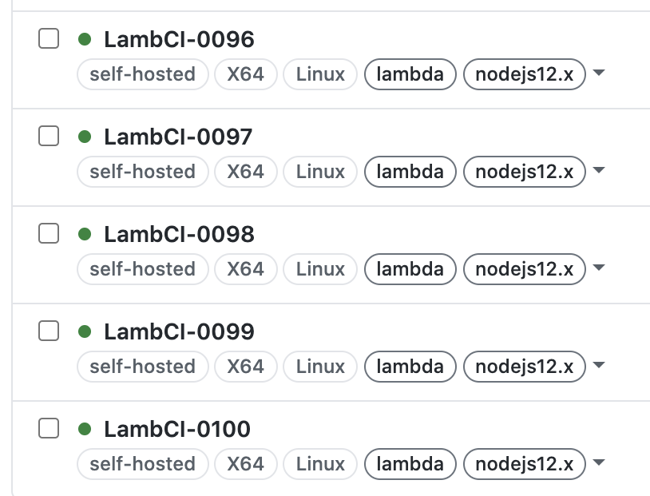
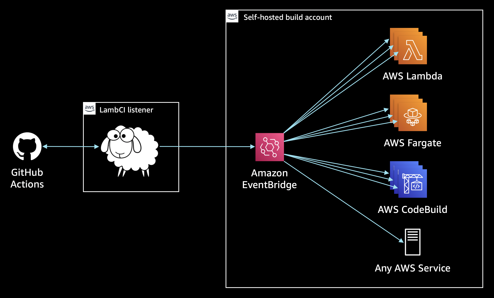

# 🐑 Serverless GitHub Actions 🚀

Run hundreds of concurrent [GitHub Actions runners](https://docs.github.com/en/free-pro-team@latest/actions/hosting-your-own-runners)
without needing to maintain servers. See a demo of it in action at the AWS re:Invent 2020 session [No more idling](https://virtual.awsevents.com/media/1_i4ejuc0d).

## What is it?

LambCI Serverless Actions enable you to run your GitHub Actions workflows on AWS Lambda and Google Cloud Run (Azure to come),
and container-based services such as AWS Fargate or AWS CodeBuild.

LambCI manages the connection to GitHub Actions and sends events over [Event Bridge](https://aws.amazon.com/eventbridge/) or [PubSub](https://cloud.google.com/pubsub). The serverless resources live in your cloud account, so you only pay while your workflows are running.

## Why would you want this over hosted GitHub Actions?

1. More (much moar) concurrency, no queueing 🚀
2. Per-second (or ms) billing, on your cloud account ⏱
3. Use IAM to access your cloud resources 🔒
4. Access to different instance sizes/capabilities (eg GPUs) 👩‍👩‍👧‍👦

## Why would you want this over another CI tool?

1. First-class citizen in the GitHub UI 🎩
2. No need to context switch or manage accounts elsewhere 🏠
3. Familiar, well-documented build specs 📃
4. Use thousands of plugins/actions from the GH community 🏙

## Source code

All the code that runs on your resources is open source. This includes the [GitHub Actions runner](https://github.com/actions/runner) and all the "glue"  necessary for invoking it (will be released soon).

## Security

GitHub Action payloads are encrypted ([at GitHub's end](https://github.com/actions/runner/blob/e291ebc58ae5fcf82b8c25b8ea64ba3a2c073617/docs/design/auth.md)) using RSA public/private key pairs. You can control this key (if you wish) so LambCI will have no visibility into the workflow job or secrets. So long as the resources in your account have access to the private key, they can decrypt the payload and run the workflow jobs in isolation.

## When?

Soon, soon! Add your email to the list over at [LambCI's homepage](https://www.lambci.com) to get updates on when this will be available to try out.
